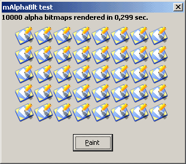



## API's AlphaBlend emulation

### Description

A little module: AlphaBlt() and AlphaBlend() functions will let you render 32-bit-alpha bitmaps onto a given DC. Use first one (faster) when rendering onto solid-color surfaces. Use second one for a complete emulation of API's AlphaBlend. // W9x and WNT systems compatible, I hope. // ~115Kb. 

----

Update #1. Added cDIB32 class (simplified version accepting only 32-bit DIB sections). Useful in case loading a resource bitmap. All properties have been preserved to allow create/edit custom alpha DIBs. Thanks go to redbird77 for the new CreateFromResourceBitmap() function. Note: compile first if you want to test this function! (also you'll get about 10 times faster results).

----

Update #2. Added a mini-tool to export 32-bit bitmaps from icon/cursor resources (XP format). 

----

Update #3 (2005.05.03). Speed up: checked special alpha values (full opaque and full transparent).
 
### More Info
 

             |
---                |---
**Submitted On**   |2005-04-05 12:51:14
**By**             |[Carles P\.V\.](https://github.com/Planet-Source-Code/PSCIndex/blob/master/ByAuthor/carles-p-v.md)
**Level**          |Intermediate
**User Rating**    |5.0 (145 globes from 29 users)
**Compatibility**  |VB 4\.0 \(32\-bit\), VB 5\.0, VB 6\.0
**Category**       |[Graphics](https://github.com/Planet-Source-Code/PSCIndex/blob/master/ByCategory/graphics__1-46.md)
**World**          |[Visual Basic](https://github.com/Planet-Source-Code/PSCIndex/blob/master/ByWorld/visual-basic.md)
**Archive File**   |[API's\_Alph188423532005\.zip](https://github.com/Planet-Source-Code/carles-p-v-api-s-alphablend-emulation__1-59786/archive/master.zip)

